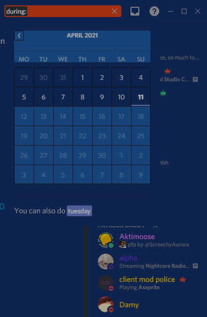

## FullyThemedDiscord
A Discord theme with easy config and sleek user UI and design. With support for multiple clients & glasscord.

## INFO

This Is NOT A THEME.

It Is intended to be used with themes that change Colours, and this fixes the stuff that doesnt change bcs of discord yeah

- Any Issues DM Leeprky#2063
  Hope You Enjoy!

## How To Install Naive

> Head to C:\Users\[USER]\powercord\src\Powercord

> Right Click "themes" and click Git Bash Here

> Type "git clone https://github.com/leeprky/FullyThemedDiscord"

> Refresh Discord

## License

MIT, see LICENSE.md for more details

## Previews

